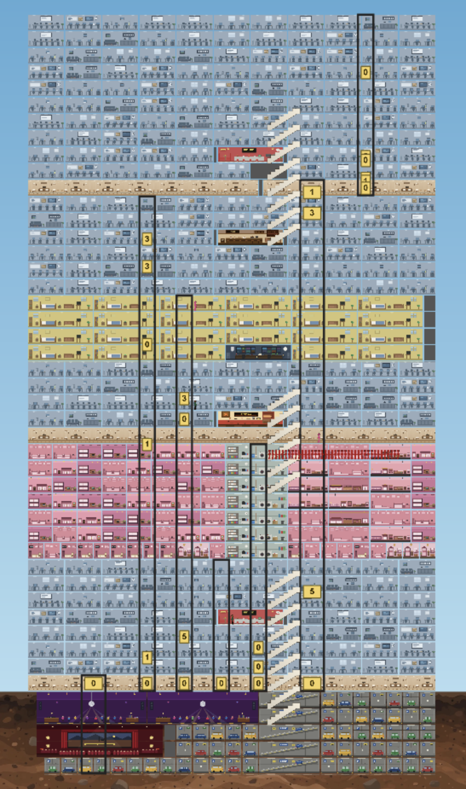

# towers.world



A tick-for-tick clone of [SimTower](https://en.wikipedia.org/wiki/SimTower) (Yoot Saito / Maxis, 1993), reimplemented as a multiplayer browser game. The simulation matches the original Windows 3.1 binary tick-for-tick — crucially, the sim state machine and elevator dispatch code aims to match exactly.

Live at **[towers.world](https://towers.world)**.

## What this is

The original SimTower is a single-player game where you build a 100-story tower out of offices, hotel suites, condos, restaurants, shops, and elevators, and try not to go bankrupt servicing the simulated tenants who move in. tower-together puts that simulation behind a Cloudflare Worker so several people can build the same tower together in real time.

The fidelity goal is strict: given the same input sequence, the reimplementation produces byte-identical state to the original binary on every tick. The trace test in [apps/worker/src/sim/trace.test.ts](apps/worker/src/sim/trace.test.ts) replays gameplay traces captured from the original DOS binary running under emulation and asserts the TypeScript sim produces the same state at every tick.

## Architecture

- **[apps/client](apps/client)** — React 19 + Vite + Phaser 4 frontend. Lobby, tower create/join, and the canvas rendering the tower grid. The client runs the same simulation locally in lockstep with the server, so rendering doesn't wait on the network.
- **[apps/worker](apps/worker)** — Cloudflare Workers backend with one Durable Object (`TowerRoom`) per tower. The DO is the authoritative input sequencer; clients submit inputs, the DO orders them into batches, and every client steps the same sim against the same input stream.
- **[apps/worker/src/sim](apps/worker/src/sim)** — Pure TypeScript simulation core. Should be independent of runtime environment and able to run entirely headless. Runs identically in the worker, the client, and the test suite. See [apps/worker/src/sim/AGENTS.md](apps/worker/src/sim/AGENTS.md) for a tour.
- **[specs/](specs)** — Reverse-engineered notes on the binary's behavior: time, demand, elevators, routing, economy, people. Partial and not always right; the trace test is the ground truth.
- **[analysis-2825a3c53f/](analysis-2825a3c53f)** — Ghidra project for static analysis of `SIMTOWER.EX_`.

## Running it

You need Node 20+ and npm 10. Install once:

```sh
npm install
```

Then run both apps:

```sh
npm run dev
```

That starts the Vite dev server for the client and `wrangler dev` for the worker via turbo. Open the URL Vite prints.

To run just one side:

```sh
npm run dev -- --filter=tower-together-client
npm run dev -- --filter=tower-together-worker
```

## Tests

The interesting test is the trace replay:

```sh
cd apps/worker
npx vitest run src/sim/trace.test.ts --testTimeout=30000
```

Each fixture in [apps/worker/src/sim/fixtures](apps/worker/src/sim/fixtures) is a `.jsonl` file of `(tick, input, expected_state)` tuples captured from the original binary. The test feeds the inputs into `TowerSim` and diffs the resulting state against the binary's state on every tick. A divergence on tick N usually means a bug on some earlier tick whose effect only became observable at N — fix the earliest divergence first.

To regenerate fixtures, see [simtower/emulator.py](simtower/emulator.py) (requires the original `SIMTOWER.EX_`, which is not in this repo).

Other useful targets:

```sh
npm run typecheck
node_modules/.bin/biome check .
```

Run both before committing.

## Deploying

```sh
npm run deploy
```

Builds the client into the worker's `dist/`, then `wrangler deploy`s the worker. The client is served as static assets from the same worker that hosts the Durable Objects.

## License

[MIT](LICENSE.md). SimTower itself is © Maxis / OPeNBooK / Yoot Saito; this project is a clean-room reimplementation and ships none of the original assets or code.
